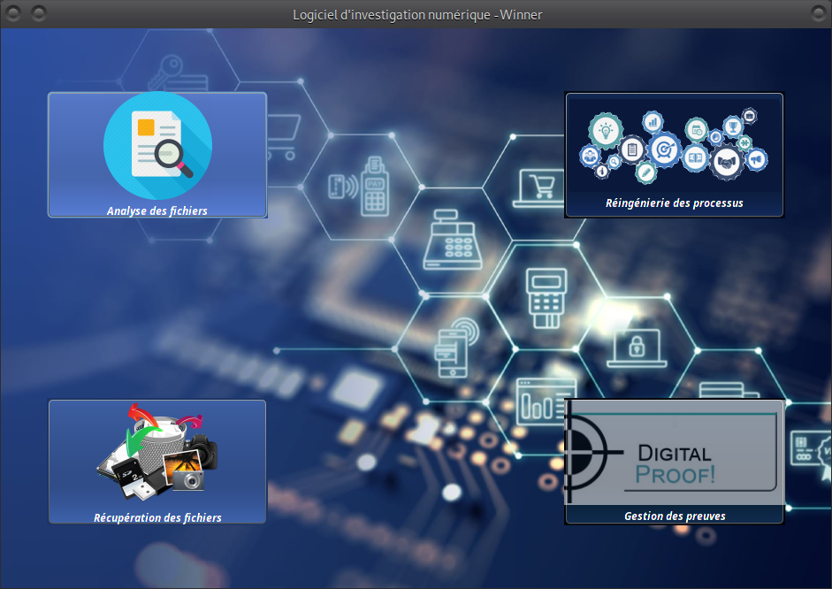
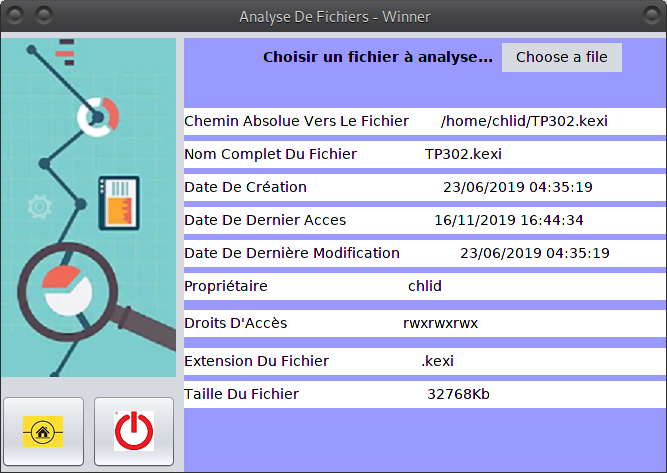
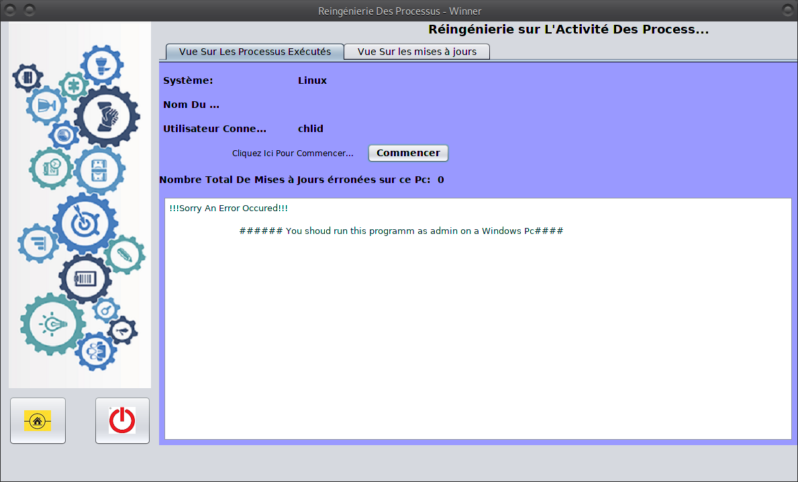
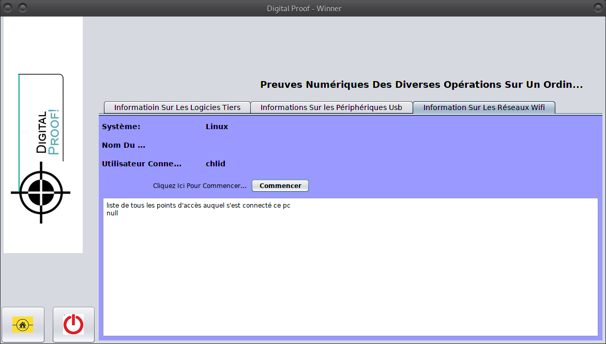

	UNIVERSITE DE YAOUNDE1 - DEPARTEMENT D'INFORMATIQUES	
		INFO323: DIGITAL FORESCIC
			TP: DEVELLOPEMENT D'UNE APPLICATION D'INVESTIGATION NUMERIQUE
				MODULES:
						1-ANALYSE DE FICHIER
						2-REINGENIERE DES PROCESSUS
						3-PREUVE NULMERIQUE
						4-RESTAURATION DE FICHIERS
#

***
    HOW TO??
		1-DOUBLE-CLIN ON Run_Me
			FOR BETTER EXPERIENCE, RUN IT AS ADMIN
***
#
/!\/!\/!\/!\/!\/!\/!\/!\/!\/!\/!\/!\/!\/!\/!\/!\/!\/!\/!\/!\/!\/!\/!\/!\/!\/!\/!\/!\/!\
	ONLY A WINDOWS VERSION IS AVAILABLE ON OUR DF_1.0
/!\/!\/!\/!\/!\/!\/!\/!\/!\/!\/!\/!\/!\/!\/!\/!\/!\/!\/!\/!\/!\/!\/!\/!\/!\/!\/!\/!\/!\
#
#
#UI

***

***

***

***

